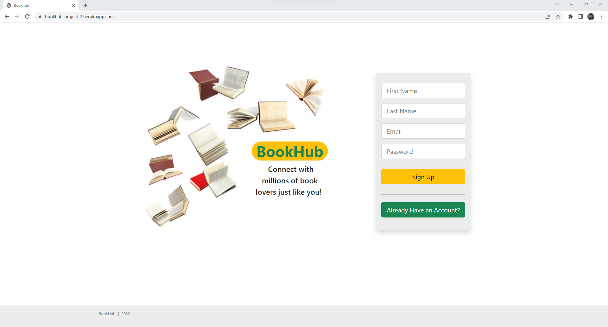
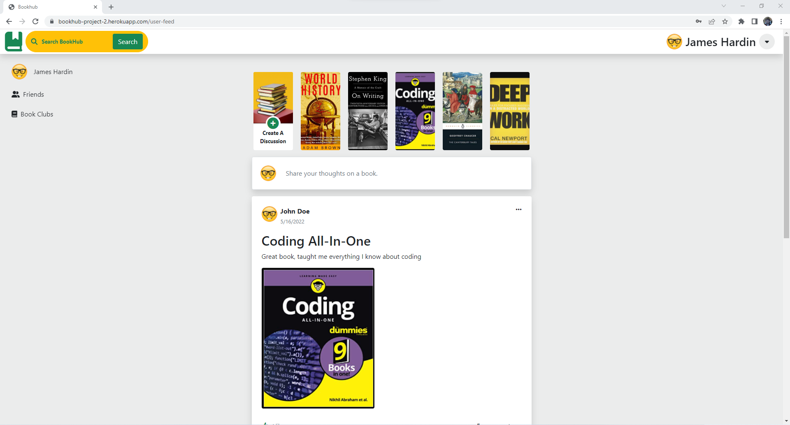
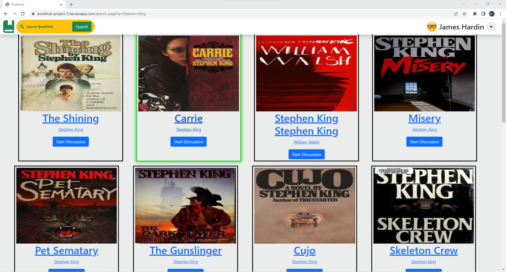

# BookHub

## Table Of Content
- [Description](#description)
- [Usage](#usage)
- [Testing](#testing)
- [Installation](#installation)
- [Features](#features)
- [Contribute](#contribute)
- [Questions](#questions)
- [License](#license)
- [Screenshots](#screenshots)

## Description 
A social media platform to connect with book lovers to discuss books

## How to use the website
Sign up for an account and start discussing the books you love! 

## Features
- Customize your profile with your favorite book genres
- Search for books by title or author
- Create a discussion post for a book you're intrested in 
  or comment on other user's discussions

## Screenshots
Sign up page where you can create an account or choose to login if you already have an account

View discussion post on the user feed page

Search for books by title or author using the search bar
